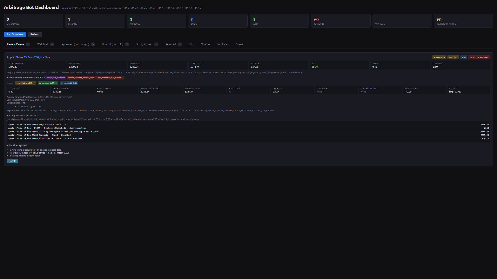

# Resale Arbitrage Bot

A local pricing-research tool that scans the UK eBay marketplace for underpriced phones (and, optionally, shoes and laptops), values each listing against live sold comparables, scores the opportunity, and tracks the full trade lifecycle from review through purchase to sale and P&L. Built as a multi-stage data pipeline behind a FastAPI dashboard, with a versioned valuation engine and 372 tests.

> **Decision-support, not auto-trading.** The bot surfaces and ranks opportunities and models the economics — buying and selling happen manually. 





## What it does

The system runs a repeating scan pipeline and exposes the results through a dashboard that covers the whole trade lifecycle:

- **Find** — queries eBay for candidate listings across the enabled categories.
- **Normalize** — parses messy listing titles into a structured identity (model, storage, condition, battery, and so on) so like is compared with like.
- **Value** — estimates a realistic resale price from live sold comparables, adjusting for condition, battery health, and how liquid the item is.
- **Score** — combines projected profit, ROI, and confidence into a single score, and flags risk.
- **Decide & track** — promising listings land in a review queue; from there you record buy/sell decisions, purchases, and sale outcomes, and the dashboard reports predicted-versus-actual P&L.

The newest feature (v15.5.9) is **target buy price / negotiation analysis**: for any listing that just missed, it inverts the profit formula to show the exact price you'd need to buy at to make it worthwhile — and whether that's a realistic best-offer discount or not.

## Architecture

A staged pipeline writes to a relational store; a FastAPI app reads from it.

```
  ┌─ Sources ───────────────┐
  │  eBay Browse API         │   (httpx + OAuth client-credentials)
  │  Mock source             │   (dev / tests)
  └───────────┬──────────────┘
              ▼
  fetch → dedupe → normalize → comp → value → score → persist      (app/pipeline.py)
                                                          │
                                                          ▼
                                              SQLAlchemy + SQLite
                                                          │
              ┌───────────────────────────────────────────┘
              ▼
  ┌─ FastAPI dashboard  +  alerts ──────────────────────────────────┐
  │  review queue · watchlist · purchases · sales · P&L · funnels    │
  │  alerts → Telegram / Discord (when thresholds are met)           │
  └─────────────────────────────────────────────────────────────────┘
```

Key points:

- **Pluggable sources.** Each marketplace implements a common `BaseSource` interface. A mock source provides deterministic data for tests and offline development; the live eBay source switches on automatically when API credentials are present.
- **Comp-based valuation engine (v2).** The heart of the system: it turns a pool of sold comparables into conservative / expected / optimistic resale ranges, applies condition and battery deltas, sanity-checks against reference anchors, and attaches a confidence score plus a human-readable explanation. It runs under explicit guardrails — for example, reference anchors can *stabilise* an estimate but never invent an opportunity on their own.
- **Versioned valuations.** Every persisted record is stamped with the valuation version, so when scoring logic changes, analytics can cleanly separate before/after data instead of mixing methodologies.
- **Two-tier thresholds.** A high bar fires real alerts; a lower bar routes candidates to the dashboard review queue for manual inspection — so nothing interesting is silently dropped.
- **Idempotent rescans.** Already-seen listings are only re-scored when enough time has passed or the price moved materially, which avoids redundant work and API calls.

## Data model

A normalized SQLAlchemy schema covers the whole lifecycle: `scan_runs`, `listings`, `normalized_listings`, `comp_snapshots`, `opportunities`, `review_candidates`, `review_decision_events`, `purchase_records`, `sale_records`, `pnl_snapshots`, `alert_log`, `lifecycle_events`, and `query_performance`.

## Tech stack

- **Backend:** Python 3.11+, FastAPI, SQLAlchemy 2.0
- **Config:** pydantic / pydantic-settings — all configuration and secrets via environment
- **HTTP:** httpx (eBay Browse API, OAuth client-credentials)
- **Scheduling:** APScheduler for the repeating scan
- **Testing:** pytest (372 tests), ruff for linting
- **Storage:** SQLite

## Testing

The suite runs to **372 tests**, including a dedicated regression file for nearly every release (`test_regression_v14` through `test_regression_v15_5_9`) plus focused suites for the valuation engine, comps, normalization, P&L, and the negotiation feature. New pricing logic ships with a regression test that pins the previous behaviour — which is what makes it safe to keep changing the scoring without silently breaking older assumptions.

```bash
pytest
```

## Running it

Requires Python 3.11+.

```powershell
python -m venv .venv
.venv\Scripts\Activate
pip install -e ".[dev]"

# Create your config from the template, then add your eBay API keys
copy .env.example .env
notepad .env

# Run a continuous scan:
python -m app.main

# Or start the dashboard:
uvicorn app.main:app --port 8000 --host 127.0.0.1
```

Your `.env` (API keys) and the SQLite database are gitignored — each install creates its own `.env` from `.env.example`.

## Security

The dashboard has **no authentication** and binds to `127.0.0.1` (local-only) by default. Do **not** expose it with `--host 0.0.0.0` unless it sits behind authentication (a reverse proxy with HTTP Basic auth, or a private tunnel) — the app trusts every request that reaches it. External listing titles and descriptions are HTML-escaped before rendering, so a malicious listing title can't inject script into the dashboard.

## Scope

Deliberately a single-user local research tool: phones-only by default for a focused validation phase (shoes and laptops are wired in and toggleable), decision-support rather than automated trading, and a local development server rather than a hardened deployment.

## Why I built it

I wanted to build a bot that scans the internet for arbitrage opportunites 

## What I learned

- Designing a multi-stage data pipeline with clear, individually testable stages
- Modelling a full domain lifecycle in a relational schema
- Building a real valuation method on noisy real-world data — comparables, outliers, confidence, and guardrails
- Integrating a third-party API: OAuth, throttling, and a mock source for offline testing
- Using a regression test suite to change core logic without fear


## What I'd do next

If i wanted to take this further the next steps for me would be to add more sources/marketplaces for a larger pool, I would incoperate sold data for better valuations and allow bot to scan for more items instead of just phones   

- More marketplaces behind the same source interface
- Richer comp modelling — recency weighting, seasonality
- Containerise and deploy behind auth so it can run continuously
- Backtest scoring changes against recorded sale outcomes
